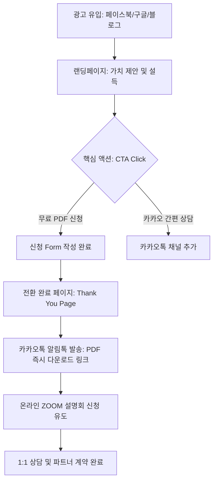

# [PRD] 헬스케어 상조 파트너 모집 세일즈 퍼널 랜딩페이지 기획안

본 문서는 **"DB 수집 극대화"**를 최우선 목표로 하는 **헬스케어 상조 파트너 모집 랜딩페이지**의 제품 요구사항 정의서(PRD)입니다. 단순한 기능 명세를 넘어, 40~65세 영업 경력자들의 심리를 자극하여 전환율(CVR)을 극대화하는 세일즈 퍼널 및 기술적 요구사항을 정의합니다.

---

## 1. 프로젝트 개요 & 비즈니스 모델

### 1.1. 프로젝트 배경 및 문제 정의
* **기존 시장의 한계**: 기존 상조 파트너 모집 광고는 대부분 "고수익 보장", "월 1,000만 원 가능" 등 자극적인 카피에 의존하여 신뢰도가 낮고, 광고 심사 반려율이 높음.
* **해결 대안**: 영업인들에게 단순 상조 판매가 아닌 **"보험을 하면서, 보험을 더 잘할 수 있게 도와주는 최고의 부업"**이자 **"고객이 먼저 찾고 평생 쓰는 헬스케어 멤버십 영업 아이템"**이라는 트렌드 변화를 제시. 
* **설득의 핵심**: "상조는 죽어서 쓰는 것" $\rightarrow$ **"살아서 혜택(간병, 병원예약, 건강검진 등)을 누리다가 마지막에 장례까지 치르는 구독형 서비스"**로의 패러다임 전환.

### 1.2. 타겟 페르소나 (Target Persona)
* **주요 연령층**: 40세 ~ 65세 남녀 영업 경험자 및 은퇴 대기자.
* **주요 직군**: 보험설계사, 렌탈 관리사(코디), 자동차 딜러, 부동산 중개업자, 통신/카드 영업인, 상조 설계사, 방문판매원 등.
* **핵심 Pain Point & 솔루션 매칭**:
  1. **고객 고갈**: 기존 인맥 영업의 한계 $\rightarrow$ "대학병원 예약 및 간병인 매칭" 등 실생활 필수 혜택으로 고객이 먼저 찾아 신뢰도 상승.
  2. **수익 감소**: 기존 상품의 계약 해지 급증 $\rightarrow$ **2주 후 신속한 첫 수당 지급** 및 **월 4회(주급식) 정산**을 통한 빠르고 안정적인 현금 흐름 확보.
  3. **환수 부담**: 보험 등 금융 영업의 높은 환수율 스트레스 $\rightarrow$ **환수 리스크 0%** 적용으로 활동 부담 최소화.
  4. **시작 장벽**: 자격시험, 교육 이수, 보증서 발급 부담 $\rightarrow$ **5無 정책 (시험 NO, 환수 NO, 출근 NO, 교육 NO, 서울보증증권 가입 NO)**으로 즉시 무자본 개시 가능.

---

## 2. 퍼널(Funnel) 상세 설계

본 랜딩페이지는 단순 방문을 넘어 DB 확보 및 최종 파트너 등록까지 유기적으로 흐르도록 설계되었습니다.

### 2.1. 전환율(CVR) 극대화 장치
1. **무료 리드 마그넷(Lead Magnet)**: "헬스케어 상조 영업 비법서 PDF" 무료 제공을 통해 고객이 정보 입력을 가볍게 느끼도록 유도.
2. **카카오 간편 폼 / 1초 로그인**: 복잡한 입력 대신 카카오 싱크(Kakao Sync) 또는 최소 정보(이름, 연락처, 현재 직업군, 활동 지역)만 입력하는 폼 배치.
3. **상하단 Sticky/Floating CTA**: 사용자가 스크롤을 내리는 동안 언제든지 신청할 수 있도록 화면 상단에 고정된 미니 상담 버튼과 화면 우측 하단에 카카오톡 채널 플로팅 버튼 배치.

---

## 3. 기술 스택 & 시스템 요구사항

### 3.1. 개발 프레임워크 및 라이브러리
* **Core**: Next.js 15 (App Router, React 19)
* **Styling**: TailwindCSS
* **Animation**: Framer Motion (스크롤 애니메이션, 페이드인, 카드 호버 등 효과 극대화)
* **Icons**: React Icons (Lucide React)
* **SEO**: Metadata API (Next.js 내장)

### 3.2. 인프라 및 최적화
* **배포**: Vercel 또는 Netlify (SSR/ISR을 활용한 극도의 로딩 속도 최적화)
* **성능 지표**: Google Lighthouse Performance 95점 이상 목표 (Mobile First 이미지 최적화 필수).
* **접근성**: Web Content Accessibility Guidelines (WCAG) AA 등급 준수 (폰트 크기, 대비 준수).

### 3.3. 마케팅 & 분석 스크립트 연동 (Analytics)
랜딩페이지 진입부터 DB 신청 완료까지 모든 행동을 추적하여 광고 효율을 극대화합니다.

* **Google Analytics 4 (GA4)**:
  - 페이지 뷰 (`page_view`)
  - 스크롤 깊이 (`scroll_depth` 25%, 50%, 75%, 90%)
  - PDF 신청 완료 이벤트 (`generate_lead`)
* **Meta Pixel (Facebook Pixel)**:
  - `PageView`
  - `Lead` (PDF 신청 완료 시 호출)
* **Kakao Pixel**:
  - `PageVisit`
  - `CompleteRegistration` (리드 전환 성공)

---

## 4. 데이터베이스 및 API 요구사항

### 4.1. DB 수집 스키마 (Lead Schema)
수집된 리드는 즉시 마케팅/영업팀으로 전달될 수 있도록 관리됩니다.

| 필드명 | 데이터 타입 | 필수 여부 | 설명 |
| :--- | :--- | :--- | :--- |
| `id` | String (UUID) | 필수 | 고유 식별자 |
| `name` | String | 필수 | 신청자 이름 |
| `phone` | String | 필수 | 휴대폰 번호 (010-XXXX-XXXX 형식 검증) |
| `job` | String | 필수 | 현재/이전 직업군 (보험, 자동차, 렌탈, 은퇴자 등 선택형) |
| `region` | String | 필수 | 활동 희망 지역 (서울, 경기, 부산 등 선택형) |
| `created_at` | DateTime | 필수 | 신청 일시 |
| `utm_source` | String | 옵션 | 광고 소스 (유입 채널 추적) |
| `utm_medium` | String | 옵션 | 광고 매체 |
| `utm_campaign` | String | 옵션 | 광고 캠페인명 |

### 4.2. API 연동 요구사항
1. **Spreadsheet 연동**: Supabase 또는 Firebase를 사용하거나, 구글 스프레드시트 API(Google Sheets API)를 통해 영업팀이 실시간으로 DB를 확인할 수 있도록 자동 기록.
2. **알림 알림톡**: DB 신청 완료 즉시 알림톡 API(비즈엠 등)를 트리거하여 신청자의 카카오톡으로 **[비즈니스 설명서 PDF 다운로드 링크]** 발송.

---

## 5. 법적 고지 및 보안 요구사항
* **개인정보 처리방침**: DB 신청 폼 하단에 개인정보 수집 및 이용 동의 필수 체크박스 노출.
* **보안**: SSL 인증서 적용(HTTPS), 입력 데이터 전송 시 암호화 처리.
